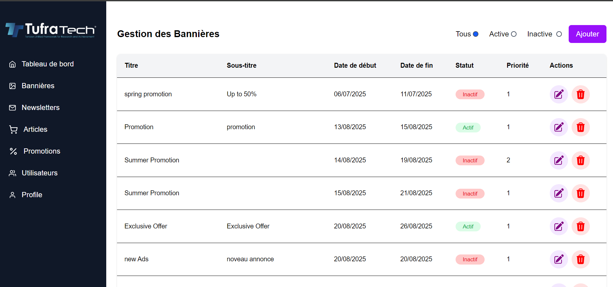
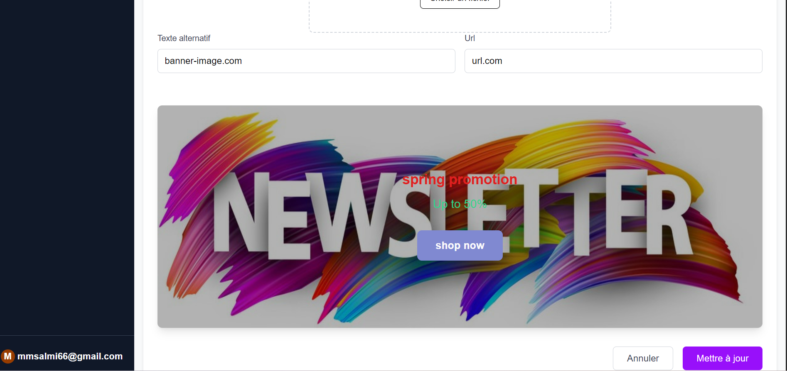
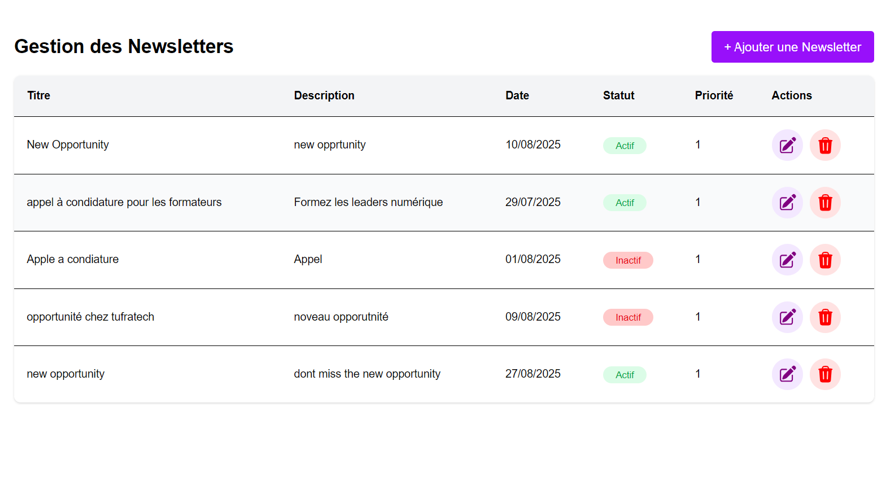
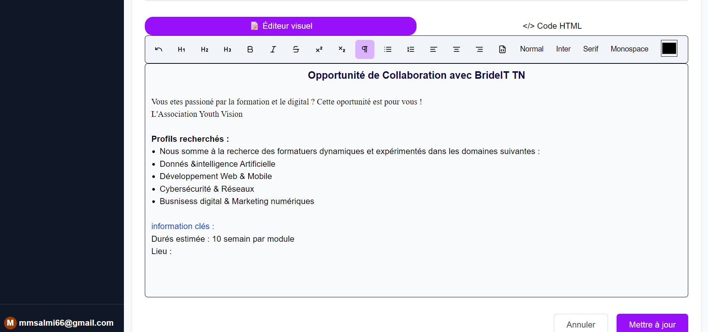
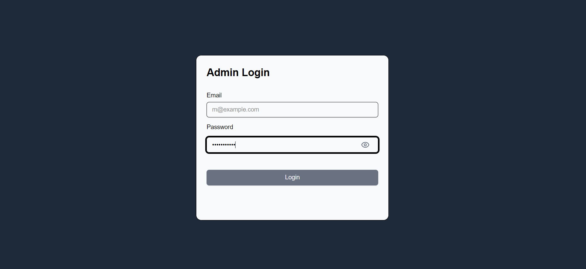
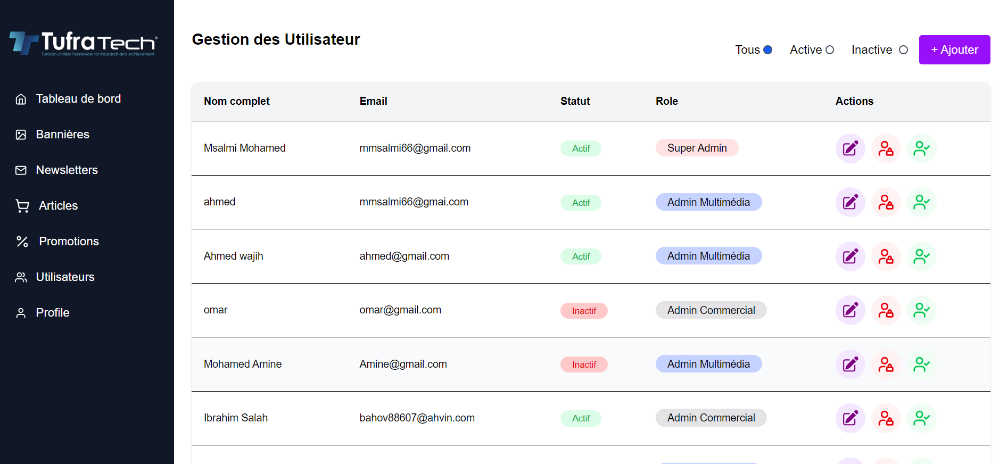
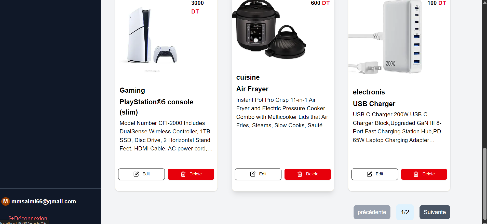
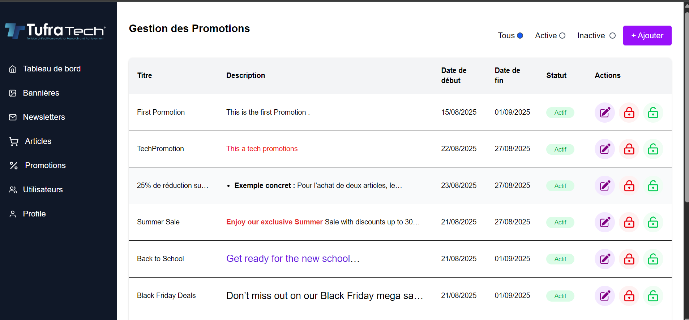
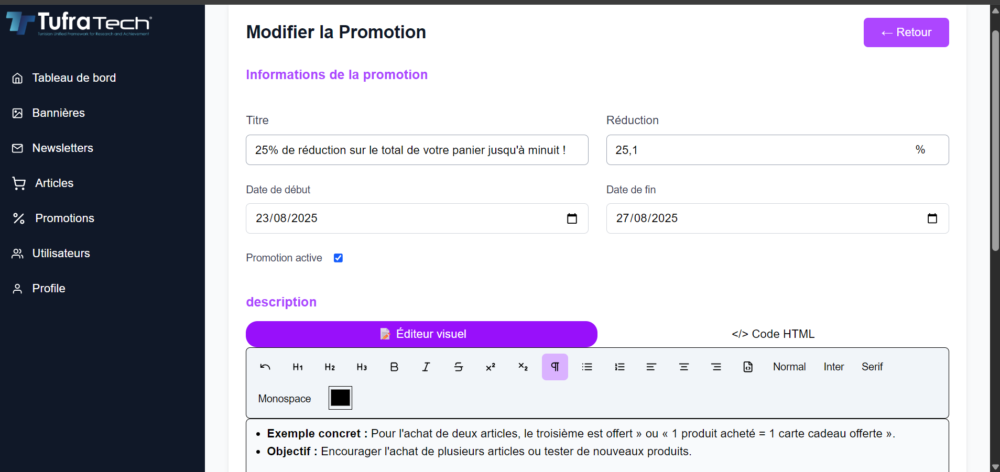

# Admin-Panel

This project involves designing and developing a simple, intuitive, and high-performance administration interface. It implements the key management modules, including banners, newsletters, users, articles, promotions, orders, and deliveries. Access security is ensured through a role- and privilege-based system, while the content displayed on the client side is managed dynamically.

## Modules : 

1. 📌 Banner :
   This module allows multimedia admin to create, edit, activate/deactivate, and prioritize banners.
    The banners can be displayed on the homepage or other sections of the website.

   

    

3. 📌 Newsletter Management :
   The administrator can send newsletters by email to all registered users, including HTML content, SEO elements, visuals, and more.

  

  

4.  📌 Admin Management
This module allows the management of administrator accounts.  
It includes the ability to **assign roles** (Super Administrator, Multimedia Administrator, Commercial Administrator) and to manage their **active/inactive status**.

5. 🔐 Security

The system is designed with strong security practices:

- **Authentication with JWT tokens** → Ensures only authenticated users can access protected endpoints.  
- **Role-based Authorization** → Access permissions are granted depending on the administrator’s role (e.g., only Super Admins can manage other admins).  
- **Login system** → Credentials are verified and a secure token is generated for subsequent requests.
  
  
  
5. 📌 Article Management
  
  This module allows administrators to add, edit, and delete products sold on the website.
  Each article includes details such as name, price, image, stock, and more.

  
  
  
6.📌 Promotion Management

  This module allows administrators to create promotional rules by selecting specific articles.
  Each promotion includes validity period, description, discount, and active/inactive status.

  

  [

## Tech Stacks : 

- <a href="https://nodejs.org/fr" target="blank"> </img></a>
**Node js** :  JavaScript runtime for the server environment
- <a href="https://nestjs.com" target="blank"></img></a>
**Nest js** : Backend framework for building scalable server-side applications
- <a href="https://nextjs.com" target="blank"></img> </a>
**Next js** :  React-based framework for the frontend with server-side rendering  
- <a href="https://www.postgresql.org/" target="blank"> </img></a>
**Postgres SQL** : Relational database for data storage

- <a href="https://tailwindcss.com/" target="blank"> </img></a>
**Tailwind css** :  Utility-first CSS framework for styling  
